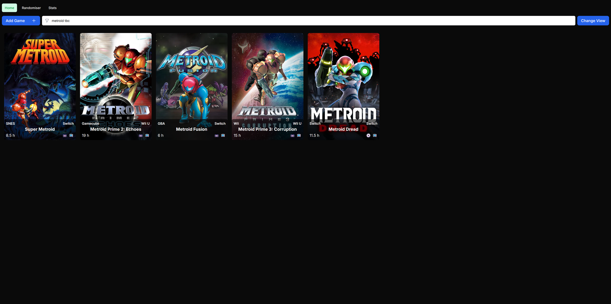

# Backlog Tracker / Game Picker

## Background ##
I made this dockerised next.js app to improve upon a backlog tracking spreadsheet I had, and I am self-hosting it in unraid.
This is my first experience with next.js and typescript, and first use of sqlite outside of CS50.

It includes typical CRUD operations into the sqlite database, as well as a randomiser to suggest a next game to play that pulls from a subset of games in the list, based on the retro/modern and handheld/desktop tags.

The biggest improvement over my old spreadsheet is the inclusion of cover art pulled from SteamGridDB.com (or uploaded manually) and ability to pull game length data directly from howlongtobeat.com using functions based on those in https://github.com/ckatzorke/howlongtobeat/.

The original style of the app is based on the next.js tutorial app, but with a fair bit of modification by now.

## Design ##
The app is made with responsive web design in mind, so mobile and desktop views are different.

#### Home page ####
The home page displays a list of all the games, which is then filterable with a search that includes keywords like "retro", "handheld, "finished" etc.
Desktop view|Mobile View
---|---
|

#### Home page grid view ####
There is a toggle to switch between table and image grid view.
Desktop view|Mobile View
---|---
|

#### Filter by keywords ####
Desktop view|Mobile View
---|---
|

#### Randomiser ####
Because it's such an arduous task deciding what to play next, there's a randomiser page which will suggest the next game to play out of playable options based on how many retro/modern and handheld/desktop games have been played to date.
Desktop view|Mobile View
---|---
|

#### Stats ####
And there's a stats page so I can see how long it will take to play all the games I want to play.
Desktop view|Mobile View
---|---
|
